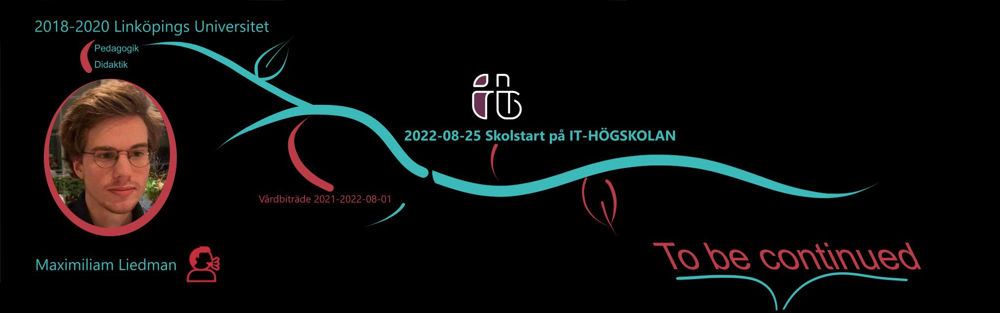

# Maximiliam Liedman :man_teacher:
## Om mig
Teknikentusiast med ett stort intresse för mjuk­ och hårdvara. Trivs med att arbeta i grupp likaväl
som självständigt. Önskar göra en positiv medverkan.
Problemlösning är något jag finner nöje i.

Jag är väldigt lugn och kan socialisera med alla sorters människor. Är en aktiv läsare av böcker och
historia som är några av mina dagliga nöjen. Jag värderar vänner väldigt högt, som jag hjärtligt
umgås med

---

## GitHub portfolio :briefcase:

| Repo                           | Description                        |
| ------------------------------ | ---------------------------------- |
| [Phyton][dl]            | Phyton course              |

<!-- | [Programmering 1][prog1]           | first programming course (gymnasiet)   | -->

[dl]: https://github.com/MxLied/Phyton-Max-Liedman
## Contact me :iphone:

- [: LinkedIn][linkedin]

[linkedin]: https://www.linkedin.com/in/maximiliam-liedman-1a5b4a249/
